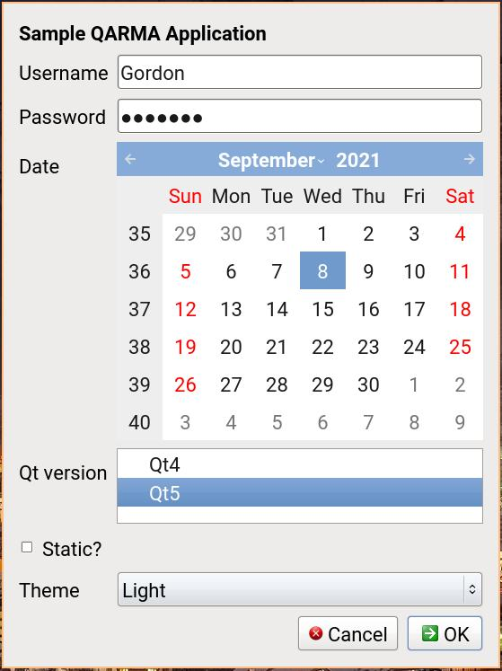

qarma
=====

Qarma is a tool to create dialog boxes, based on Qt.
It's a clone of Zenity which was written for GTK+.

Examples
========

```bash
qarma --forms --add-entry="Username" --add-password="Password" \
--add-calendar="Date" --text="Sample QARMA Application" \
--add-list="Qt version" --list-values="Qt4|Qt5" \
--add-checkbox="Static?" \
--add-combo="Theme" --combo-values="Light|Dark|System"
```



Building
========
On Ubuntu:

```bash
sudo apt install qt5-default libqt5x11extras5-dev
mkdir build && cd build
qmake .. && make
```

Packaging
=========
<a href="https://repology.org/project/qarma/versions">
    
</a>

FAQ
===

Q: Why do you waste time cloning a perfectly fine tool?

A:
"The answer is that GTK+ is primarily intended to be used on the GNOME desktop"
"GTK+ must focus on being the toolkit of the GNOME platform first, and tackle
 integration second."

See this [LWN Article](https://lwn.net/Articles/562856/) and this
 [blog post](http://blogs.gnome.org/mclasen/2014/03/21/dialogs-in-gtk-3-12/).

Q: Does the name mean anything?
A: Yes.
